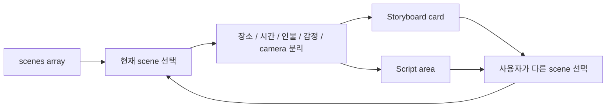

<div align="center">

# 🎬 TRAVEL

### A short film, organized scene by scene.

학교 단편영화 `TRAVEL`의 이야기·감정·카메라 흐름을 **장면 데이터 기반 storyboard**로 정리한 정적 웹사이트입니다.

<p>
  
  
  
</p>

[Scene Model](#scene-model) · [Render Flow](#render-flow) · [Files](#files)

</div>

---

대본을 긴 문서로만 보는 대신 **장면마다 장소·시간·인물·감정·카메라 의도를 함께 보기 위해** 만든 사이트입니다.

## Scene model

각 장면은 JavaScript object 하나로 관리합니다.

| Field | Meaning |
|---|---|
| title / scene | 장면 번호와 제목 |
| place / time | 장소와 시간 |
| mood | 장면 분위기 |
| people / focus | 등장인물과 시선 중심 |
| emotion | 감정 강도 |
| camera | 촬영 메모 |
| beat | 장면의 핵심 변화 |
| script | 실제 대사와 행동 |

## Render flow



대본과 화면을 따로 하드코딩하지 않고 **`scenes` 데이터를 source of truth로 사용**합니다. `script.js`에서 한 장면을 고치면 같은 데이터를 쓰는 여러 표시가 함께 바뀝니다.

## Files

```text
index.html   page structure
styles.css   cinematic layout / responsive styles
script.js    scene data + interactions
```

## Run

정적 사이트라 `index.html`을 브라우저에서 바로 열 수 있습니다.

GitHub Pages를 사용할 경우 기본 브랜치 root를 배포 대상으로 둘 수 있습니다.

---

<div align="center">

**One story. One source of truth for every scene.**

</div>
